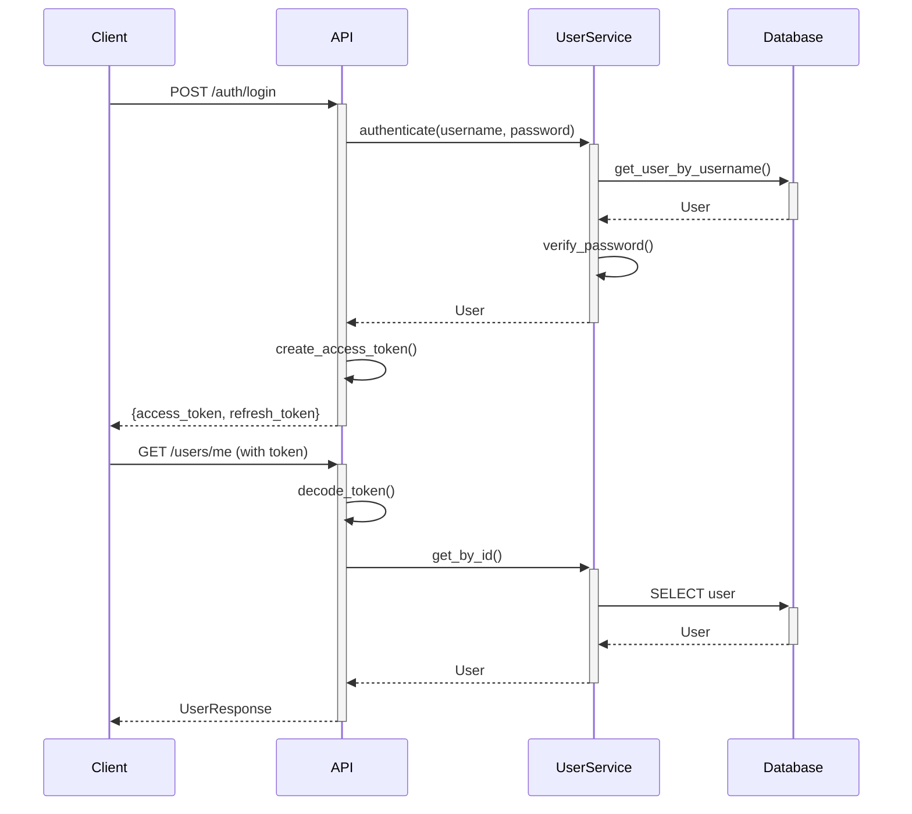

# Architecture Documentation

## System Overview

This FastAPI application follows a **layered architecture** pattern with clear separation of concerns:

```
┌─────────────────────────────────────┐
│         FastAPI Routes              │  ← HTTP Layer
├─────────────────────────────────────┤
│         Service Layer               │  ← Business Logic
├─────────────────────────────────────┤
│         Data Layer (SQLModel)       │  ← Database Access
└─────────────────────────────────────┘
```

## Key Design Decisions

### 1. Async-First Architecture

- **Why**: Modern Python apps benefit from async I/O for database and HTTP operations
- **Implementation**: SQLModel with AsyncSession, httpx for external APIs
- **Benefits**: Better resource utilization, higher throughput

### 2. Dependency Injection

- **Why**: Testability, loose coupling, easier to mock dependencies
- **Implementation**: FastAPI's `Depends()` system
- **Example**: Database sessions, authentication, services

### 3. Service Layer Pattern

- **Why**: Separate business logic from HTTP concerns
- **Implementation**: Service classes (e.g., `UserService`)
- **Benefits**: Reusable logic, easier testing, cleaner routes

### 4. Custom Exceptions

- **Why**: Consistent error handling across the application
- **Implementation**: Base `AppException` with specific subclasses
- **Benefits**: Automatic HTTP status codes, structured error responses

## Component Details

### Routes (API Layer)

**Purpose**: Handle HTTP requests/responses, validation, authentication

```python
@router.post("/users", response_model=UserResponse)
async def create_user(
    user_data: UserCreate,
    user_service: UserServiceDep
) -> UserResponse:
    user = await user_service.create(user_data)
    return UserResponse.model_validate(user)
```

**Responsibilities**:
- Input validation (Pydantic)
- Authentication/authorization
- Delegate to services
- Format responses

### Services (Business Logic Layer)

**Purpose**: Business logic, orchestration, validation

```python
class UserService:
    async def create(self, user_data: UserCreate) -> User:
        # Check uniqueness
        # Hash password
        # Create user
        # Log event
        return user
```

**Responsibilities**:
- Business rules
- Data validation beyond schema
- Orchestrate multiple operations
- Transaction management

### Models (Data Layer)

**Purpose**: Data structures, database schemas

```python
class User(UserBase, table=True):
    id: int | None = Field(primary_key=True)
    hashed_password: str
    created_at: datetime
```

**Responsibilities**:
- Database schema definition
- Data validation (Pydantic)
- Relationships
- Serialization

## Authentication Flow



## Database Design

### Users Table

```sql
CREATE TABLE users (
    id SERIAL PRIMARY KEY,
    email VARCHAR UNIQUE NOT NULL,
    username VARCHAR UNIQUE NOT NULL,
    hashed_password VARCHAR NOT NULL,
    full_name VARCHAR,
    is_active BOOLEAN DEFAULT true,
    is_superuser BOOLEAN DEFAULT false,
    created_at TIMESTAMP DEFAULT NOW(),
    updated_at TIMESTAMP DEFAULT NOW()
);

CREATE INDEX idx_users_email ON users(email);
CREATE INDEX idx_users_username ON users(username);
```

## Error Handling Strategy

1. **Validation Errors** (422)
   - Pydantic catches these automatically
   - Returns detailed field-level errors

2. **Business Logic Errors** (400/409)
   - Custom exceptions (e.g., `ConflictError`)
   - Service layer throws, route catches

3. **Authentication Errors** (401/403)
   - JWT validation
   - Permission checks

4. **Server Errors** (500)
   - Unexpected exceptions
   - Logged with full stack trace
   - Generic message to client

## Security Considerations

### Authentication

- **JWT** with short-lived access tokens (30 min)
- **Refresh tokens** for long-lived sessions (7 days)
- **Password hashing** with bcrypt (cost factor 12)
- **Token validation** on every protected endpoint

### Input Validation

- **Pydantic models** for all inputs
- **Field validators** for complex rules
- **SQL injection protection** via SQLModel/SQLAlchemy
- **XSS protection** via JSON responses (no HTML rendering)

### Rate Limiting

- **Planned**: Redis-based rate limiting
- **Current**: Basic CORS configuration

### Secrets Management

- **Environment variables** for all secrets
- **Never commit** `.env` files
- **Rotate** secrets regularly in production

## Performance Optimizations

### Database

- **Connection pooling** (20 connections, 10 overflow)
- **Async queries** for non-blocking I/O
- **Indexes** on frequently queried fields
- **Pagination** for list endpoints (TODO)

### Caching

- **Redis** available for caching
- **LRU cache** for config settings
- **Planned**: Cache frequently accessed data

### Logging

- **Async logging** with loguru
- **Structured logs** for production
- **Log rotation** to prevent disk issues

## Deployment Architecture

```
┌─────────────────┐
│   Load Balancer │
└────────┬────────┘
         │
    ┌────┴────┐
    │         │
┌───┴──┐  ┌──┴───┐
│ App  │  │ App  │  (Multiple instances)
│  1   │  │  2   │
└───┬──┘  └──┬───┘
    │        │
    └────┬───┘
         │
    ┌────┴────────┐
    │  PostgreSQL │
    └─────────────┘
         │
    ┌────┴────────┐
    │    Redis    │
    └─────────────┘
```

## Monitoring Strategy

### Health Checks

- `/health` - Basic liveness
- `/health/ready` - Dependencies check
- `/health/live` - Container health

### Metrics (Future)

- Request rate
- Response time
- Error rate
- Database query time
- Cache hit rate

### Logging

- **Levels**: DEBUG (dev), INFO (prod), ERROR (always)
- **Retention**: 30 days for info, 90 for errors
- **Format**: Structured JSON in production

## Testing Strategy

### Unit Tests

- **Service layer** - Business logic
- **Utilities** - Helper functions
- **Models** - Validation rules

### Integration Tests

- **Routes** - Full request/response cycle
- **Database** - Actual queries (test DB)
- **Authentication** - Token generation/validation

### Test Coverage Goals

- **Minimum**: 80% overall
- **Critical paths**: 100% (auth, payments, etc.)
- **Exclude**: Configuration, migrations

## Scalability Considerations

### Horizontal Scaling

- **Stateless** application design
- **Session storage** in Redis (not in-memory)
- **File uploads** to S3 (not local disk)

### Database Scaling

- **Read replicas** for read-heavy workloads
- **Connection pooling** to limit connections
- **Query optimization** with EXPLAIN

### Caching Strategy

- **Application level**: Function results, config
- **Database level**: Query results
- **HTTP level**: CDN for static assets

## Future Enhancements

1. **GraphQL** support (Strawberry)
2. **WebSocket** support for real-time
3. **Background tasks** with Celery
4. **File uploads** with S3 integration
5. **Email** notifications with SendGrid
6. **Rate limiting** with Redis
7. **API versioning** strategy
8. **Pagination** for list endpoints
9. **Filtering/Sorting** for queries
10. **Audit logging** for sensitive operations

---

**Last Updated**: 2025-01-04
**Author**: Homero Thompson del Lago del Terror
